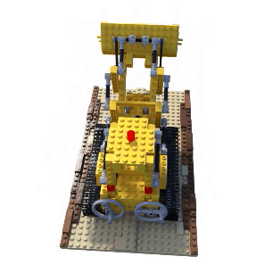
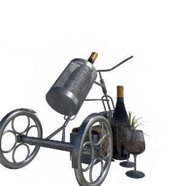
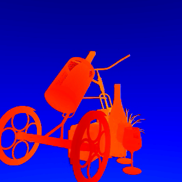
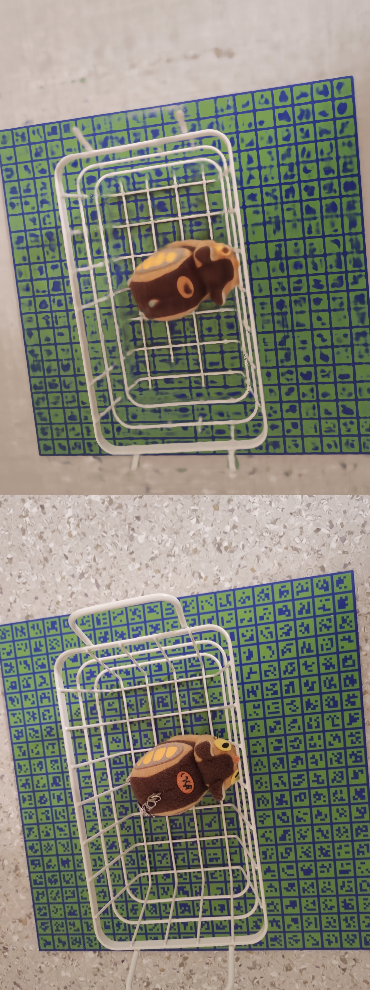
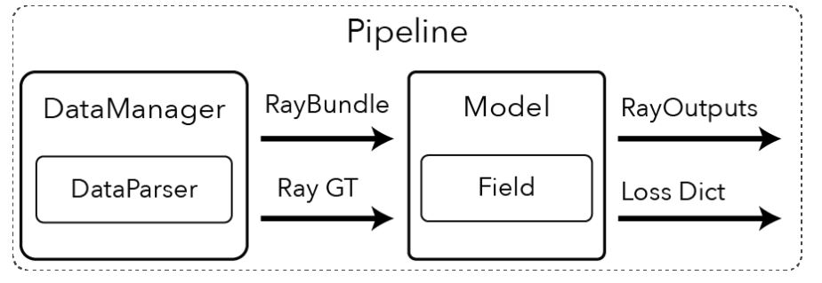

# PyTorch-implemented nerf-based models

## Models
This repo provides PyTorch code for models that use the "NeRF" method to generate 3D images of objects. Currently, it supports 4 different models:

- [NeRF](https://arxiv.org/abs/2003.08934)
- [NeuS](https://arxiv.org/abs/2106.10689)
- [TensoRF](https://arxiv.org/abs/2203.09517)
- [Nerfies](https://arxiv.org/abs/2011.12948)

## Hardware

The models are trained using following hardware:

- GPU: GTXX 1660 SUPER
- RAM: 32GB
- CPU: Ryzen 7 5700X

## Result

- Performance

| NeRF | NeUS | Nerfies | TensoRF |
|:---:|:---:|:---:|:---:|
|Training speed|4it/s|5it/s|4it/s|-|
|Rendering speed|21s/img|60s/img|-|-|

### NeRF
 

### TensoRF
 

 

### NeuS
 

## Pipeline benchmark : NerfStudio

- Target: DataManager, Model pipeline is customized upon our environment
    - NOTE! RayGT and RayOutputs are currently dictionaries. In the future, they will be typed objects.
- Component
    - RayBundles
        - the input to the forward pass of the Model. needed for both training and inference time
        - describe origin, viewing directions, which are used in rendering process
    - RayGT objects, however, are needed only during training to calculate the losses in the Loss Dict.
        - information like pixel ground truths, whic are used in loss computation

---
# References
1. pytorch repo : [link](https://github.com/yenchenlin/nerf-pytorch/tree/1f064835d2cca26e4df2d7d130daa39a8cee1795)
2. volumetric rendering in NeRF [link](https://keras.io/examples/vision/nerf/)
3. Camera calibration [link](https://www.mathworks.com/help/vision/ug/camera-calibration.html)
4. NeUS [link](https://github.com/Totoro97/NeuS/tree/6f96f96005d72a7a358379d2b576c496a1ab68dd)
5. NeRF Studio
    - [blog](https://xoft.tistory.com/26), [Docs](https://docs.nerf.studio/en/latest/index.html)
    - [Camera model](https://docs.nerf.studio/en/latest/nerfology/model_components/visualize_cameras.html)
        - Instrinsic/Extrinsic
        - Equirectangular/Spherical Camera Model
        - Distortion Parameters
    - [Sample representation](https://docs.nerf.studio/en/latest/nerfology/model_components/visualize_samples.html)
    - [Ray samplers](https://docs.nerf.studio/en/latest/nerfology/model_components/visualize_samplers.html)
        - Strafied Sampling, Heirarchical Sampling 
    - [Spatial distortions](https://docs.nerf.studio/en/latest/nerfology/model_components/visualize_spatial_distortions.html)
    - - [Encoders](https://docs.nerf.studio/en/latest/nerfology/model_components/visualize_encoders.html)
